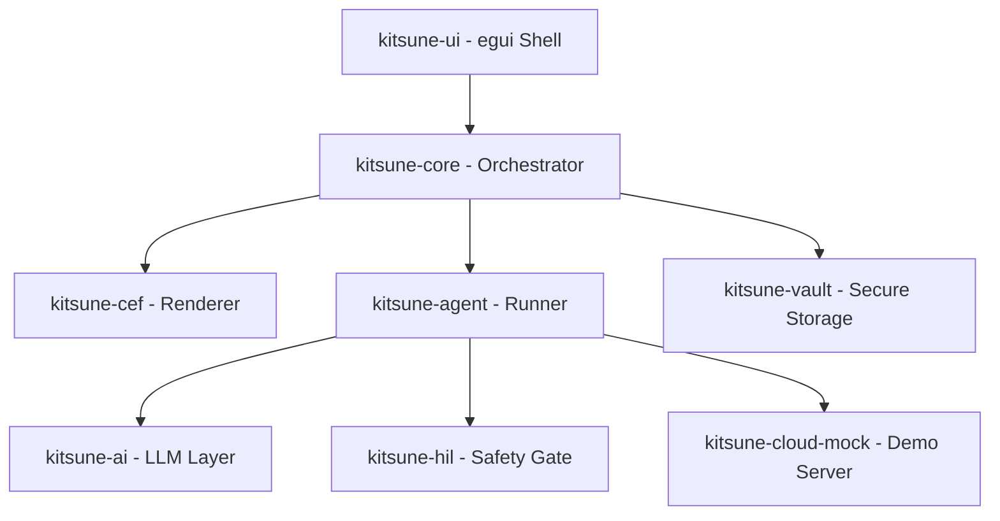

# KitsuneEngine — Project Context & Architecture

## 1. Overview

**KitsuneEngine** is an agentic, privacy-first browser engine built in Rust. It combines a native desktop shell with a powerful AI agent pipeline and Human-in-the-Loop (HIL) security.

- **Current Stack**: Rust, `egui` (Native UI), `CEF` (Chromium Embedded Framework for rendering).
- **Primary Goal**: To provide a secure, automated browsing experience where AI agents can perform complex tasks on behalf of users without compromising privacy or financial security.

### Core Philosophy

- **Human-in-the-Loop (HIL)**: Consequential actions (payments, form submissions, credential usage) require explicit human confirmation via a non-bypassable security gate.
- **Privacy-First**: Zero telemetry by default. Sensitive data is stored in a secure, encrypted vault and never leaves the device without consent.
- **Agentic Native**: Designed from the ground up to support autonomous agents with structured logs, budget tracking, and tool-use capabilities.

---

## 2. System Architecture

KitsuneEngine follows a multi-process/multi-crate modular architecture:



---

## 3. The 12 Crates — Role and Implementation

### `kitsune-ui` (Native UI Shell)

- **Role**: The main desktop application entry point. Implements the browser "chrome" (tabs, address bar, navigation controls) using `egui`.
- **Key Features**: Privacy dashboard, Agent shelf, Settings dialog, and the always-on-top HIL approval window.

### `kitsune-core` (Orchestrator)

- **Role**: Manages browser state, tab lifecycle, navigation history, and configuration.
- **Key Files**: `engine.rs` (Lifecycle), `tab.rs` (Tab state), `navigation.rs` (History).

### `kitsune-cef` (Rendering Engine)

- **Role**: High-level Rust bindings for the Chromium Embedded Framework (CEF). Handles the actual rendering of web content and JavaScript execution.

### `kitsune-agent` (Agent Runtime)

- **Role**: The "brain" of the browser. Executes asynchronous agent tasks, manages budgets, and interacts with the DOM through the CEF layer.
- **Key Concepts**: `Runtime` (Execution loop), `Spec` (Agent definitions), `Budget` (Resource tracking).

### `kitsune-hil` (Human-in-the-Loop)

- **Role**: Security protocol for manual approval. Blocks agent execution until a human provides a cryptographically verifiable decision.

### `kitsune-vault` (Encrypted Storage)

- **Role**: Secure storage for API keys, passwords, and user data. Uses `age` encryption and Argon2id for key derivation.

### `kitsune-ai` (AI Model Layer)

- **Role**: Abstraction layer for interacting with LLM providers (OpenAI, Anthropic, or local models).

### `kitsune-cloud-mock` (Simulation Server)

- **Role**: A mock SSE server used for hackathon demonstrations and local development to simulate agentic behaviors and site navigations.

### `kitsune-ipc` (Messaging)

- **Role**: Infrastructure for communication between the UI shell and the core engine.

### `kitsune-net` (Network Layer)

- **Role**: Security-hardened network utilities and tracker blocking logic.

### `kitsune-sandbox` (Isolation)

- **Role**: Windows-specific utilities for process isolation using Job Objects.

### `kitsune-agent-builder` (DSL)

- **Role**: Tools for defining and compiling complex agent workflows.

---

## 4. Key Workflows

### Agentic Navigation

1. User provides a natural language instruction in the Agent Shelf.
2. `kitsune-agent` parses the intent and starts a task.
3. The agent sends a `UrlUpdate` event to `kitsune-core`.
4. `kitsune-core` instructs `kitsune-cef` to navigate the active tab.

### HIL Approval

1. An agent attempts a sensitive action (e.g., clicking "Buy Now").
2. The agent pauses and sends a `HilRequest` via `kitsune-hil`.
3. `kitsune-ui` pops up the HIL Dialog, blurring the background.
4. If the user approves, the agent resumes execution; otherwise, the task is terminated.

---

## 5. Build & Run

### Prerequisites

- Rust 1.75+
- CEF binaries (should be located in the `target/` or root directory as per project setup)

### Commands

```powershell
# Run the browser in debug mode
cargo run

# Build the production release
cargo build --release
```

---

## 6. Current Project Status (Hackathon Milestone)

The project is currently in the "Hackathon Finalization" phase.

- **Active Mock**: The engine uses `kitsune-cloud-mock` to demonstrate realistic agentic shopping/research flows.
- **UI Progress**: The `egui` shell is fully functional with tab management, a stylized premium logo, and responsive navigation controls.
- **Focus**: Resolving native window occlusion issues and stabilizing the agentic pipeline for live demos.
